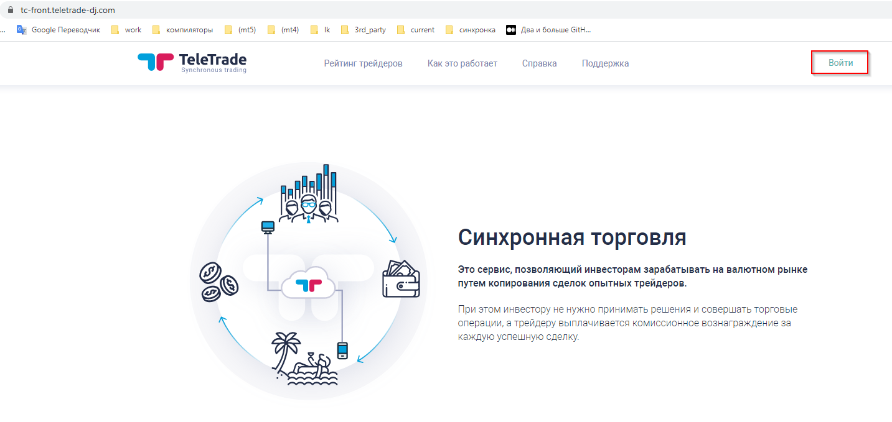
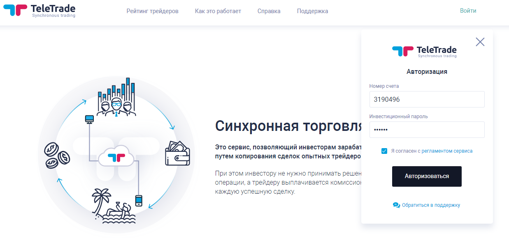
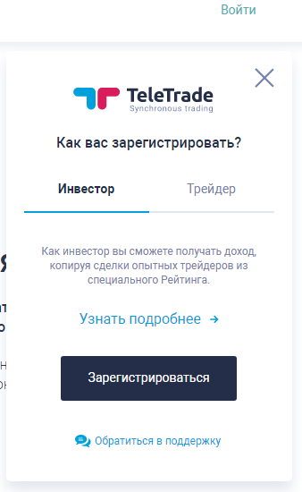
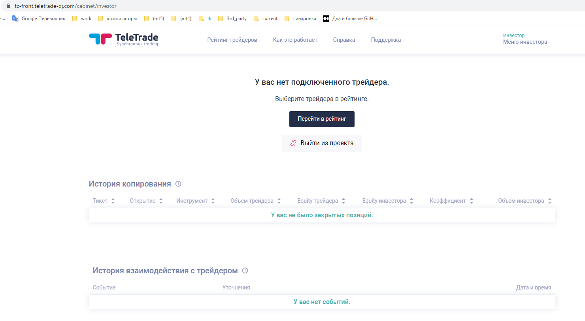
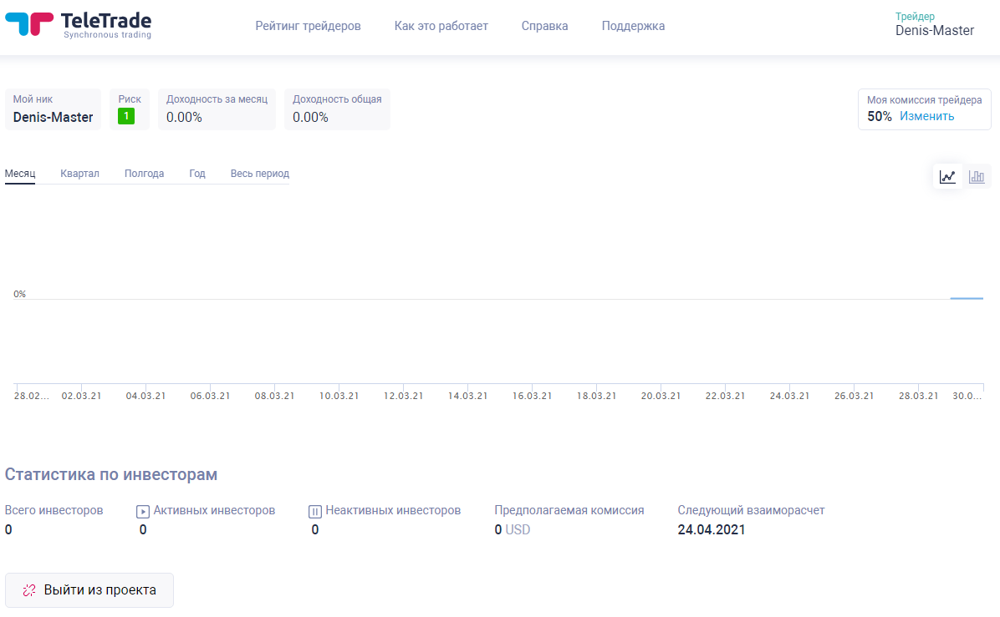

 

[P]: ../icons/progress.png  "2021y-06m-03d"
[S]: ../icons/success.png   "2021y-06m-03d"
[F]: ../icons/failed.png    "2021y-06m-03d"
[D]: ../icons/danger.png    "2021y-06m-03d"
[E]: ../icons/empty.png     "2021y-06m-03d"
[B]: ../icons/bug.png       "2021y-06m-03d"
[N]: ../icons/na.png        "2021y-06m-03d"
[M]: #prepare   "подготовка рабочей среды"  

rdp-виртуалки  
---

|   метак    | rdp:address                            | rdp:numeric           |  
|:----------:|:--------------------------------------:|:---------------------:|  
| (MT4) amts | mttest-amts.teletrade-dj.com:18172     | 94.130.83.229:18172   |  
| (MT4) ndd  | mttest-ndd.teletrade-dj.com:33309      | 88.99.205.117:33309   |  
| (MT5) sync | hz-gw18.teletrade-dj.com:18173         | 94.130.83.229:18173   |  
| (srv) sync | mttest-galasync.teletrade-dj.com:33894 | 148.251.132.133:33894 |  

 
 

метаки  
---
                                            
|   метак    | address                            |   localhost   |  
|:----------:|:----------------------------------:|:-------------:|  
| (MT4) amts | mttest-amts.teletrade-dj.com:44372 | localhost:443 |  
| (MT4) ndd  | gw18.teletrade-dj.com:44373        | localhost:443 |  
| (MT5) sync | hz-gw18.teletrade-dj.com:44373     | localhost:443 |  

как начать работать  
---

Алгоритм:  
  - 1. Заходим на какой нибудь метак  
    - 1.1.  Создаём мастера  
    - 1.2.  Создаём инвестора  
  - 2. Заходим на сайт [ЛК][LK]  
    - 2.1.  Сайт может запросить базовую авторизацию (защита от случайных людей на этапе разработки)  
      - 2.1.1.  Вводим логин: www  
      - 2.1.2.  Вводим логин: 12345  
    - 2.2.  Когда страничка сайта загрузится, справа-сверху будет кнопка войти  
            

            
Войти на сайт

              
               
            

    - 2.3.  Нажимаем "войти", и вводим логин клиента метака, а так же его *инвесторский* пароль  
            

            
Ввод логина и пароля

              
               
            

    - 2.4.  После чего сервис выполняет поиск указанного пользователя по всем зарегистрированным в нём метакам.  
            Если такого пользователя нет, тогда клиент должен увидеть сообщение с ошибкой.  
            В случае успеха процедура авторизации считается успешно завершенной.  
    - 2.4.1.  В синхронной торговле все пользователи делятся на мастеров или инвесторов.  
              Когда авторизуется новый клиент, ему сразу предалагают стать мастером или инвестором.  
              

              
выбираем кем быть: мастером или инвестором

                
                 
              

    - 2.5.  В результете, после успешной авторизации/регистрации откроется рабочее окошко мастера или инвестора:  
              

              
окно инвестора

                
                 
              

               
              

              
окно мастера

                
                 
              

  - 3.1.  Теперь можно торговать.  

[LK]: https://tc-front.teletrade-dj.com/  "личный кабинет новой синхронки"

