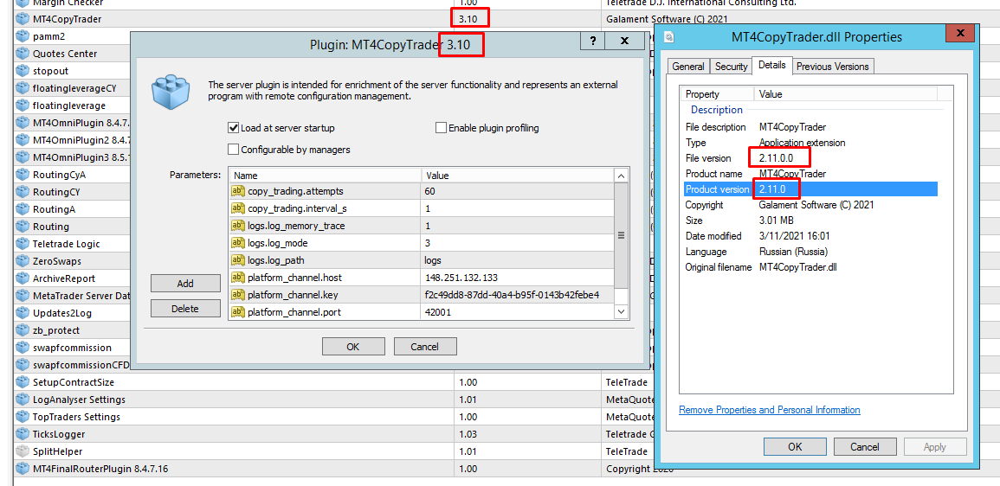

 

[P]: ../icons/progress.png  "2021y-06m-03d"
[S]: ../icons/success.png   "2021y-06m-03d"
[F]: ../icons/failed.png    "2021y-06m-03d"
[D]: ../icons/danger.png    "2021y-06m-03d"
[E]: ../icons/empty.png     "2021y-06m-03d"
[B]: ../icons/bug.png       "2021y-06m-03d"
[N]: ../icons/na.png        "2021y-06m-03d"
[M]:  #-version  "проверяем версию продукта"  
[SS]: #-version  "проверяем версию продукта"  

[![S]][M] version
---
- Версия продукта отображается в названии бранчей или веток в gitlab.  
- Версия продукта отображается в свойствах бинарника.  
- Версия плагина так же отображается в админке, в настройках плагина.  

Во всех этих местах версия продукта должна совпадать.  

-----------------------------------------------

История тестирования:  

| дата начала         |     дата конца      | длительность | исполнитель  | версия |   статус   |  
|:-------------------:|:-------------------:|:------------:|:------------:|:------:|:----------:|  
| 2021y-06m-03d 21:35 | 2021y-06m-03d 21:45 |    10 min    | Kartonagnick | 2.13.0 | [![S]][SS] |  
| 2021y-04m-01d 11:00 | 2021y-04m-01d 11:10 |    10 min    | Kartonagnick | 2.11.0 | [![B]][B1] |  

[B1]:  #-0000-Обнаружена-ошибка  "версии не совпадают"  

[![B]][M] 0000: Обнаружена ошибка
---------------------------------

Скриншот

  
   

