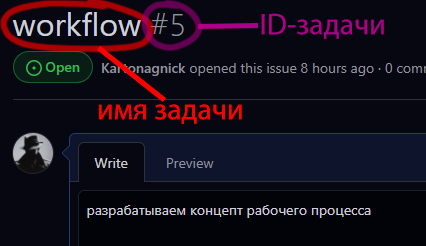
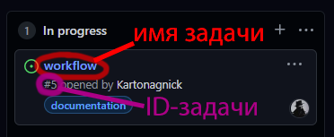
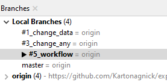


task
====

Основная идея:  
проект не должен быть прибит гвоздями к какому то одному таск-треккеру.  
Он всегда должен быть готов к миграции в другую систему.  

Что бы не зависеть от прихотей такс-треккеров,  
копии всех задач должны храниться в нашем репозитории.  
Такой подход гарантирует, что при миграциях на другие системы,  
история задач не пострадает.  


Порядок создания задач
----------------------

1. Сначала задача создаётся в таск-треккере.  
   <details>
   <summary>Скриншот</summary>
   <a href="#github" title="github"></a>
   <br/>
   <a href="#github" title="github"></a>
   <br/>
   </details>

2. Когда разработчик принимает задачу в разработку,  
   он первым делом создаёт отдельную ветку  
   с таким же названием, как в треккере.  
   <details>
   <summary>Скриншот</summary>
   <a href="#smartgit" title="smartgit"></a>
   <br/>
   </details>

3. В своей ветке, в каталоге `docs\tasks`,  
   разработчик заводит файл задачи, в котором дублируется текст задачи.  
   Имя файла задачи задаётся в формате: `{data}-{id}-{name}.md`  
     - `{data}` - дата, когда задача была взята в разработку.  
       (может отличаться от даты начала работ)  
     - `{id}`   - числовой номер задачи.  
     - `{name}` - текстовое имя задачи.  
   Например: `2021y-01m-04d-00002-workflow.md`  
     - `2021y-01m-04d` - дата, когда задача поступал в разработку.  
     - `00022`         - номер `issue`.  
     - `workflow`      - имя задачи.  

4. По мере увеличения количества задач, количество файлов будет расти.  
   Для удобства навигации можно архивировать старые задачи.  
   Архивы располагаются здесь же - в подкаталогах.  
   Например:  
   ```
   docs\tasks
    |--- 2020
    |     `-- archive.7z
    |
     `-- 2021y-01m-04d-00002-workflow.md
   ```
   В примере выше, `2020` - подкаталог, который содержит архив задач за 2020 год.  

5. При описании некоторых задач могут понадобиться дополнительные материалы.  
   Например - картинки. Они должны храниться здесь же - в каталоге задач.  
   На треккерах же размещаем копию.  

6. **Важно:** задачи не переоткрываются !!!  
   Переоткрытие задачи - это на самом деле создание новой задачи,  
   со своей собственной `{data}`, `{id}`, и `{name}`

7. Разрешается создавать задачи с одинаковым `{name}`  
   Считается, что задачи с одинаковым `{name}` - это задачи,  
   связанные с одним и тем же бизнес-объектом.  


Содержимое файла задачи
-----------------------

Задача состоит из двух разделов:  
  - Таблица с датами.  
  - Описание задачи.  

Рассмотрим пример:  

```
| дата начала         |   дата конца        | длительность | исполнитель  |
|:-------------------:|:-------------------:|:------------:|:------------:|
| 2020y-05m-18d 22:40 | 2020y-05m-18d 23:10 | 30 min       | Kartonagnick |

#1 first
========
Добавляем корневые файлы репозитория:  
  - [x] файл `.gitignore`  
  - [x] файл `README.md`  
    - [x] содержит ссылку на документацию для разработчиков.  
        - [x] клик по картинке.  
    - [x] содержит описание проекта.  
  - [x] файл `LICENSE`  
    - указываем авторство:  
        - `Denis aka Kartonagnick`

Добавляем каталог с документацией:  
  - [x] каталог `docs`:  
    - [x] каталог `tasks` для хранения задач.  
      - [x] там размещаем файл с задачей, который вы сейчас читаете.  
    - [x] каталог `icons` с иконками для оформления документации.  
      - [x] для оформления документации.  
    - [x] логотип проекта `logo.png`  
    - [x] файл `history.md`  
    - [x] файл `home.md`  
      - [x] содержит ссылку на документацию для пользователей.  
        - [x] клик по картинке.  
```

`дата начала`  
  - дата начала работы над задачей.  

`дата конца`  
  - дата завершения работы над задачей.  
  - если задача ещё не завершена,  
    тогда здесь указывается дата,  
    когда ожидается её завершение.  

`длительность`  
  - время, которое было затраченно на эту задачу.  
  - если задача ещё не завершена,  
    тогда здесь указывается примерное время,  
    которое ожидается потратить на задачу.  

`исполнитель`
  - ФИО или никнейм исполнителя.  
  - должно однозначно идентифицировать исполнителя.  

Под таблицей располагается параграф:  
  - Формат: `#{id} {name}`  
  - Например: `#1 first`  

Далее следует описание задачи.  
Описание задачи должно быть достаточно полным,  
что бы было понятно, что за задача решается.  

Текст описания задачи должен совпадать с текстом задачи в треккере.  
Текст выполняется в форме чек-листа.  
Чек-лист представляет собой план проведения работ.  
Где галочками отмечаются завершенные этапы.  
Удобно для оценки степени готовности задачи.  

